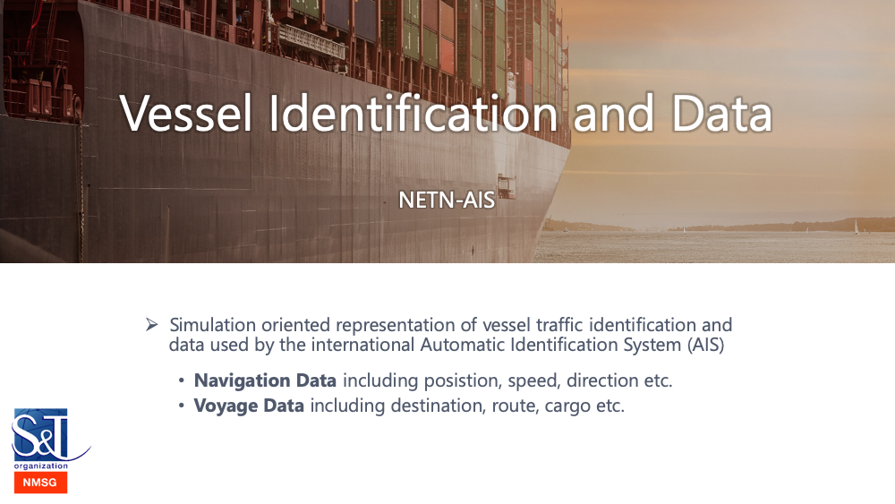

# NETN-AIS

## Introduction

NATO Education and Training Network (NETN) Automatic Identification System (AIS) Module.

The Automatic Identification System (AIS) is a world-wide automated tracking system used on vessels and by Vessel Traffic Services (VTS) for identifying and locating vessels by electronically exchanging messages with other nearby vessels and VTS stations. 27 message types are defined in ITU-R M.1371-5 annex 8 (see https://www.itu.int). Most commonly used message types are the Position Report Class A (Message types 1,2, and 3) and the Static and Voyage Related Data (Message type 5). And a commonly used live protocol to exhange AIS messages is NMEA-0183. This is an electrical and data specification for communication between marine electronics (see https://www.nmea.org).

The AIS FOM module defines all of the messages types specified in ITU-R M.1371-5 annex 8, with the exception of rarely used message types or message types that are more related to traffic analysis in an AIS network (i.e. 15, 16, 20, 22, 23, 25 and 26). The FOM class structure is closely aligned with the message type specification in ITU-R M.1371-5 annex 8, enabling easy translation to/from NMEA 0183. The message types are modelled as interaction classes and most of the class parameters are optional. The root class - AisMessage - is integrated in the RPR-FOM by subclassing RadioSignal, using the concept of HostRadioIndex to refer to the RadioTransmitter object instance on board of the vessel. The AIS message types include SOTDMA and ITDMA communication state data, but the parameters related to communication state can be omitted if there is no need to model communication.

The AIS FOM module content is based on available open source material from the United States Coast Guard (https://www.navcen.uscg.gov), the GPSD project website (https://gpsd.gitlab.io/gpsd/AIVDM.html), and ITU-R M.1371-5.

### Purpose

The purpose of the AIS FOM module is to enable the exchange of AIS messages in both a real-time and non real-time platform level simulation, and to support the translation of AIS messages to/from the NMEA 0183 protocol using for example generic gateway components. The AIS FOM module defines almost all of the AIS message types, whose content can be interpreted by applications without knowledge of the NMEA 0183 protocol.

### Scope

The AIS FOM module is simulation oriented and does not focus on the communication of live AIS data. However, the FOM is aligned well with the specification in ITU-R M.1371-5, enabling relatively easy mapping to/from NMEA 0183.

## Licence

Copyright (C) 2019 NATO/OTAN.
This work is licensed under a [Creative Commons Attribution-NoDerivatives 4.0 International License](LICENCE.md). 

The work includes the [NETN-AIS.xml](NETN-AIS.xml) FOM Module and documentation NETN-AIS.md.

Above licence gives you the right to use and redistribute the NETN FOM Module (XML file and Documentation) in its entirety without modification. You are also allowed to develop your own new FOM Modules (in separate XML files and separate documentation) that build-on/extends the NETN module by reference and including neccessary scaffolding classes. You are NOT allowed to modify this FOM Module or its documentation without prior permission by the NATO Modelling and Simulation Group. 

## Versions, updates and extentions

All updates and versioning of this work is coordinated by the NATO Modelleing and Simulation Coordination Office (MSCO), managed by the NATO Modelling and Simulation Group (NMSG) and performed as NATO Science and Technology Organization (STO) technical activities in support of the NMSG Modelling and Simulation Standards Subgroup (MS3).

Feedback on the use of this work, suggestions for improvements and identified issues are welcome and can be provided using GitGub issue tracking. To engage in the development and update of this FOM Module please contact your national NMSG representative.

Version numbering of this FOM Module and associated documentation is based on the following principles:

* New official version number is assigned and in effect only when new release is made in the Master branch.
* Updates in the Develop branch will not change version number.
* In the FOM Module useHistory information include only information on official releases.
* Update of the major version number is made if the change constitute a major restructuring, merging, addition or redefinition of semantics that breaks backward compatibility or cover entirely new concepts.
* Update of the minor version number is made if the change constitute a minor additions to existing concepts and editorial changes that do not break backward compatibility but may require updates of software to use new concepts.
* Patches are released to fix minor issues that do not break backward compatibility.